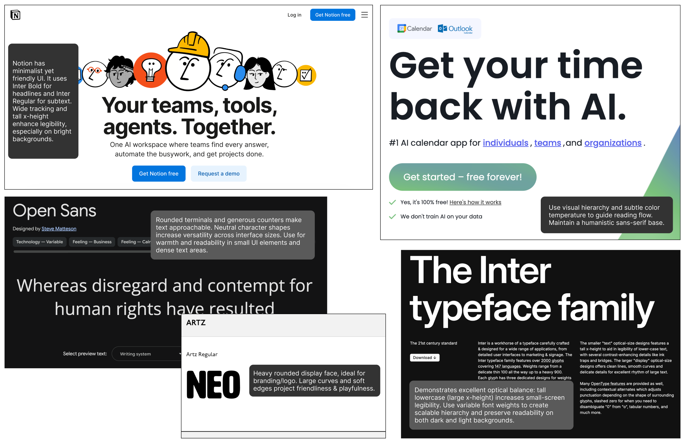
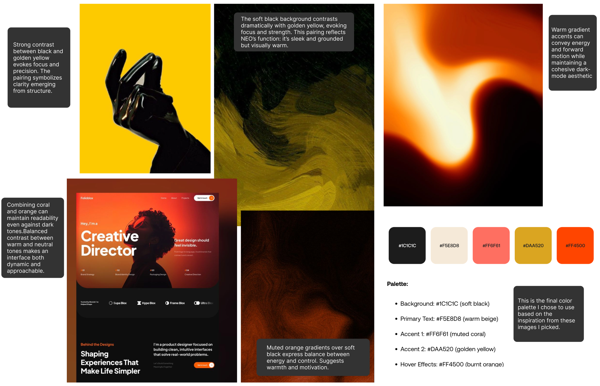
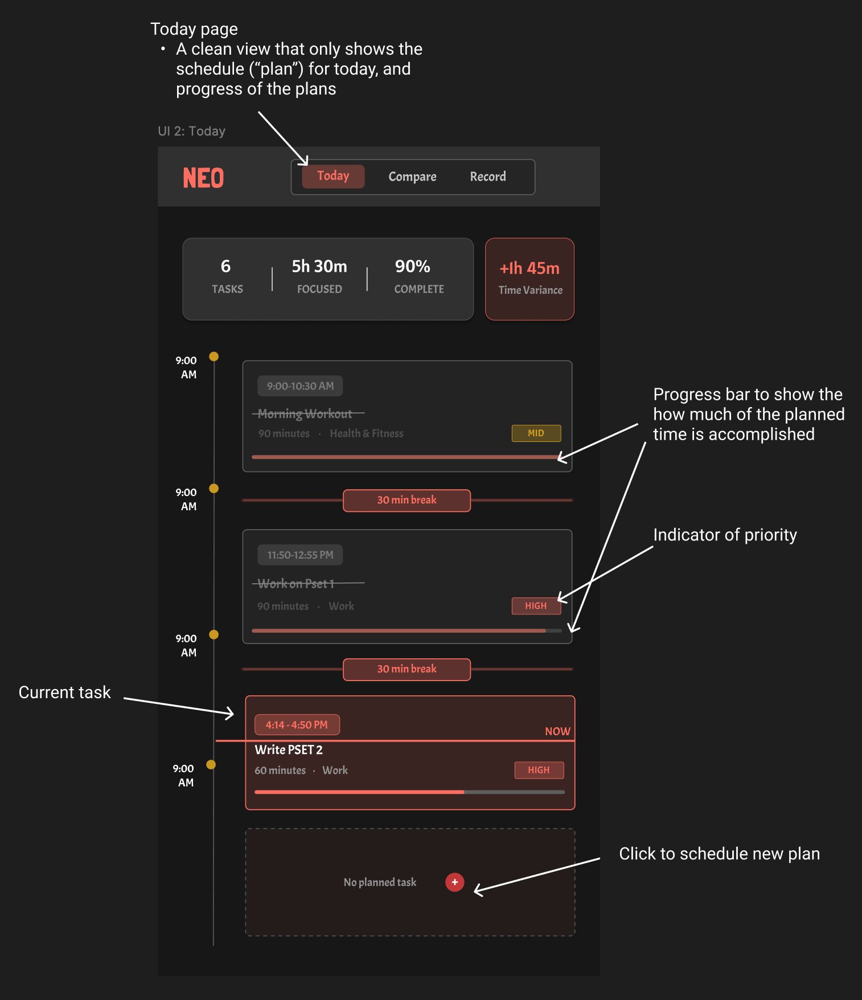
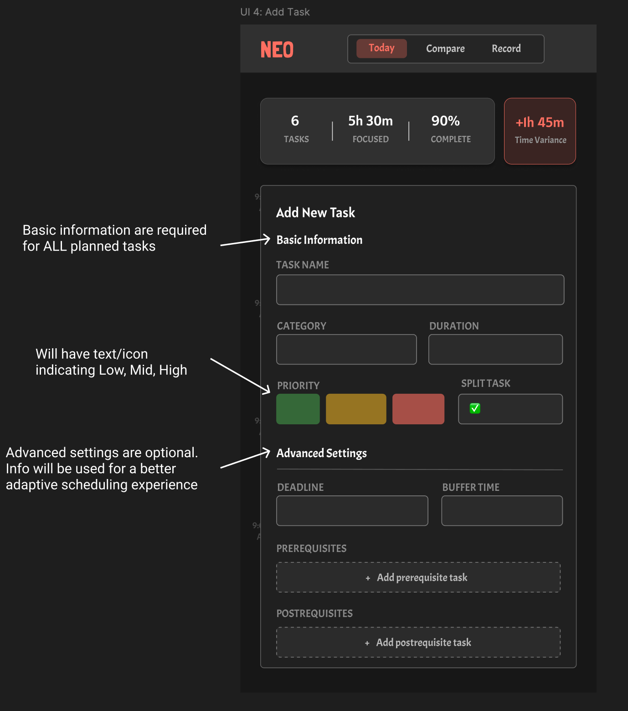
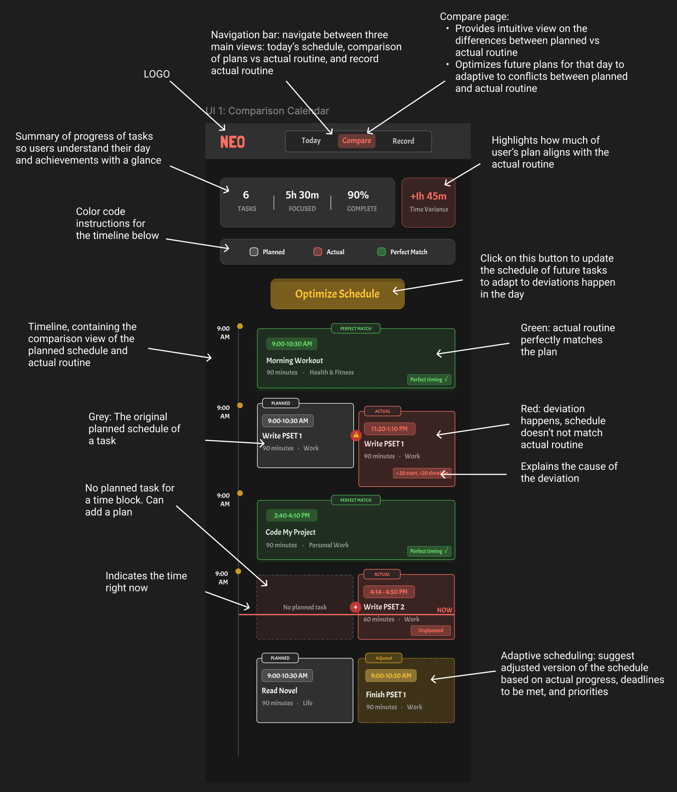
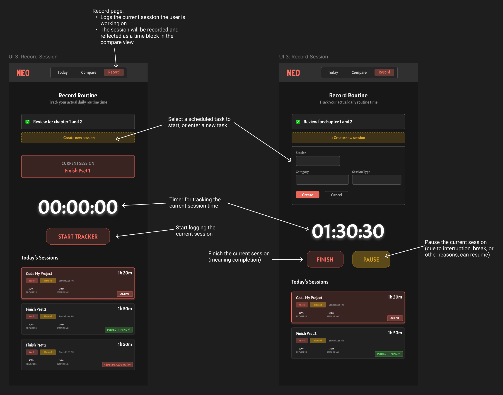
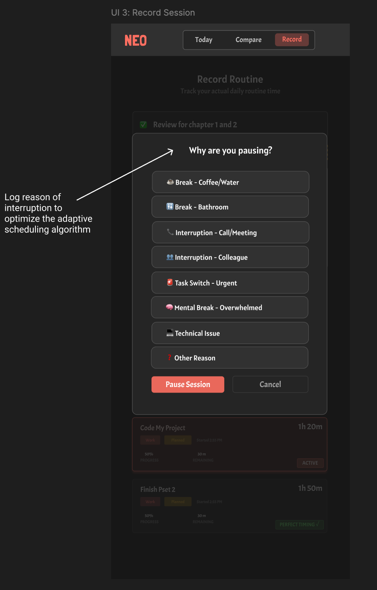

# Neo Frontend
> NEO - The ONE scheduling tool you need.
Most productivity tools force people into rigid plans that crumble the moment real life interferes, while students and professionals need not just another complex and static planner, but a dynamic companion that learns, adjusts, and helps them actually boost productivity. Neo is the ONE calendar app you need. Think of it as your digital personal assistant that adjust your daily plans dynamically as your day unfolds. Neo tackles the scheduling and productivity problems by making daily planning flexible and adaptive.

# Screen Recording
Click on the image below, and you will get redirected to a youtube video.

[](https://www.youtube.com/watch?v=9NCZIb1qXjs)

# Visual design study




# Styling and layout






# User Journey
Friday, a product manager at Microsoft, starts his Tuesday with a perfectly organized schedule in Notion Calendar, balancing meetings, roadmap planning, and focus work. But by mid-afternoon, his plan collapses after three ad-hoc meetings, two urgent pings, and a new task from his lead, pushing all his focus work aside. Frustrated, Friday turns to Neo, a scheduling tool that adapts to reality. He adds his remaining tasks—“Write Product Spec,” “Team Sync,” and “Review Customer Feedback”—assigns priorities and other task related attributes, then views an updated timeline showing what’s left for the day. Friday then goes to the session page, and Neo then starts logging the session progress for “Write Product Spec.” When an urgent engineering call interrupts his “Write Product Spec” session, Neo logs the interruption cause and later helps him adaptively optimize his future schedule, automatically rescheduling non-critical work and prioritizing deadlines. By evening, the compare page shows which plans held, which shifted, and how his time was reallocated. Instead of guilt, Friday feels clarity: Neo turns disruption into insight, helping him finish his most important work and plan more realistically over time. Friday learns about his own focus pattern, energy cycles, and work habits. Most importantly, Neo's adaptive calendar helps him finished most of his high-priority tasks. Over time, Friday builds more realistic schedules and feels more effective as a busy product manager.

# Running the app

1. Install dependencies:
```bash
npm install
```

2. Start the development server:
```bash
npm run dev
```

3. Make sure to call `deno task concepts` in the backend directory to start the backend API before running the frontend.

4. Open your browser and navigate to `http://localhost:5173`

The frontend will automatically reload when you make changes to the code.